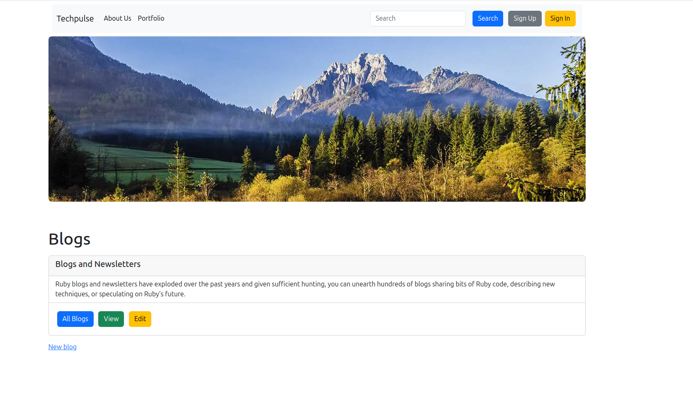

# Rails Blog Application Project

This project is designed to help you build a real Rails application with essential features such as signup, login, and CRUD operations for posts.



## Description

In this project, you will:
- Gain hands-on experience in creating a Rails application.
- Explore the Model-View-Controller (MVC) architecture.
- Use common Rails commands and generators.
- Develop features for user authentication and post management.

## Working Modules

- **Signup**: User registration functionality.
- **Login**: User authentication and session management.
- **CRUD for Posts**: Create, Read, Update, and Delete operations for posts.

## Getting Started

### Prerequisites

Ensure you have Rails installed. Verify with:
```sh
rails --version
```

### Installation

1. Clone the repository:
   ```sh
   git clone [git@github.com:fabortwell/pulsetech.git]
   ```
2. Navigate to the project directory:
   ```sh
   cd [pulsetech]
   ```
3. Install dependencies:
   ```sh
   bundle install
   ```

### Usage

1. Start the Rails server:
   ```sh
   rails server
   ```
2. Open your browser and navigate to:
   ```
   http://localhost:3000
   ```

## Contribution

Contributions are welcome! Fork the repository, create a new branch, and submit a pull request.

## License

This project is licensed under the MIT License.

---

